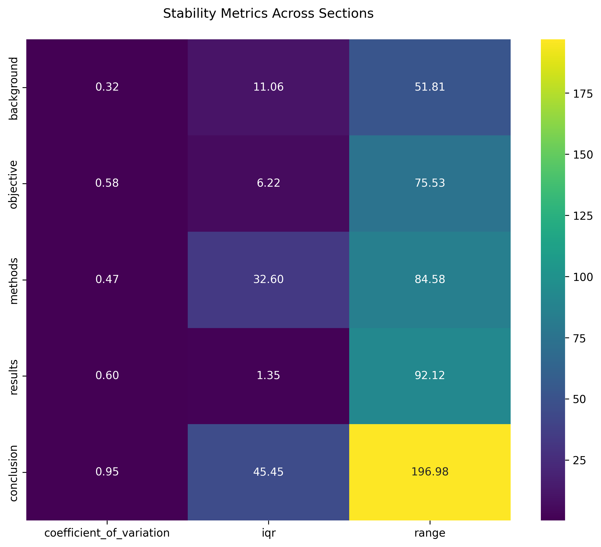

# LLM Scientific Hypothesis Generation Research

## Research Agenda

This research stream explores the intersection of Large Language Models (LLMs) and scientific discovery, focusing on understanding and potentially harnessing LLMs' capabilities for hypothesis generation.

### Thematic Question
How can we understand and potentially harness LLMs' hallucination mechanisms for "creative" hypothesis generation in the domain of scientific discovery?

### Specific Question
How do LLMs select between multiple hypotheses?

## Reports

### Report 1: Interpreting LLM-Generated Scientific Hypotheses (February 2025)

#### Technical Summary

This study investigates the mechanisms behind LLM-generated scientific hypotheses by analyzing how different sections of research paper abstracts influence the generation process. Using TinyLlama-1.1B-Chat and attribution analysis, we examined the relationship between abstract structure and hypothesis generation.

#### Methodology


The experiment uses Captum Feature Attribution framework to analyze how different sections of scientific abstracts influence the model's hypothesis generation process.

#### Key Findings

1. **Section Influence Distribution**

- Conclusions demonstrate the highest influence (23.7%)
- Methods sections follow closely (21.3%)
- Background sections show significant impact (19.7%)
- Results and objectives show moderate influence (18.5% and 16.9% respectively)

2. **Correlation Analysis**

- Strong negative correlation (-0.95) between objectives and conclusions
- Strong positive correlation (0.89) between results and objectives
- Moderate negative correlation (-0.51) between background and methods

3. **Section Length Analysis**

No direct correlation between section length and attribution scores, suggesting content quality and positioning are more critical than length.

4. **Stability Analysis**

- Background sections show highest consistency (CV: 0.32)
- Methods sections display moderate stability (CV: 0.47)
- Conclusions show highest variability (CV: 0.95)

#### Next Steps


Future work will focus on investigating the relationship between hypothesis generation, ranking, and attribution analysis.

## Repository Structure

```
.
├── reports/
│   └── report_070225.docx
├── images/
│   ├── experimental_setup.png
│   ├── correlation_matrix.png
│   └── ...
├── data/
├── analysis/
└── README.md
```

## Citation

```bibtex
@article{mahmud2025interpreting,
  title={Interpreting LLM-Generated Scientific Hypotheses: Framework and Initial Findings},
  author={Mahmud, Adnan},
  year={2025}
}
```

## License

This project is licensed under the MIT License - see the LICENSE file for details.
