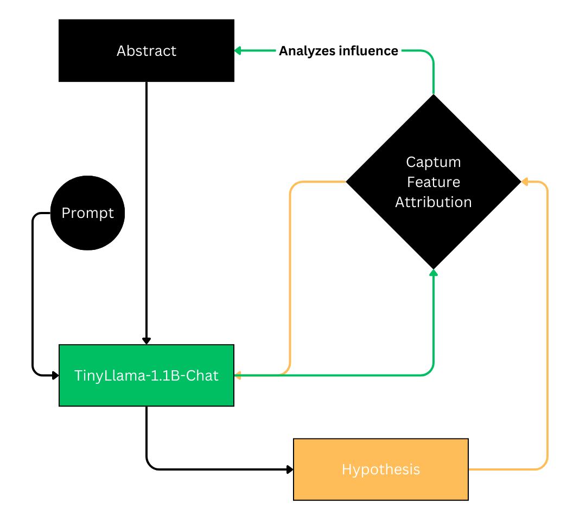
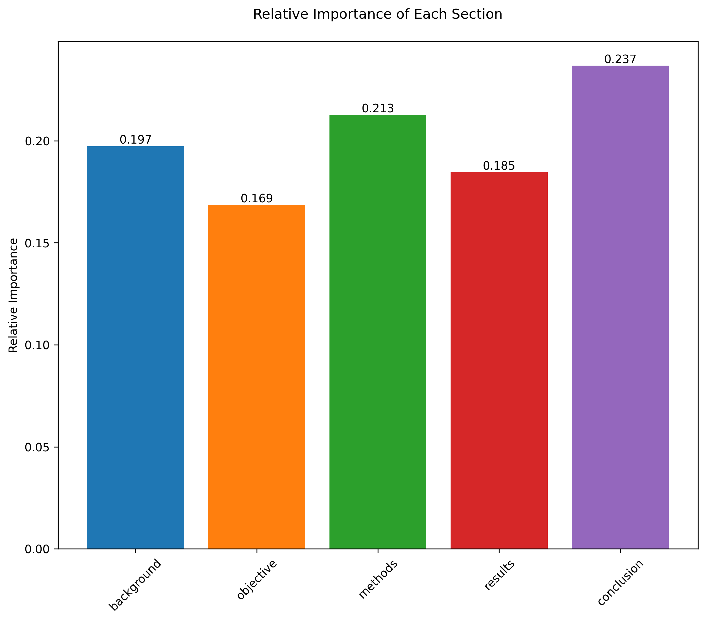
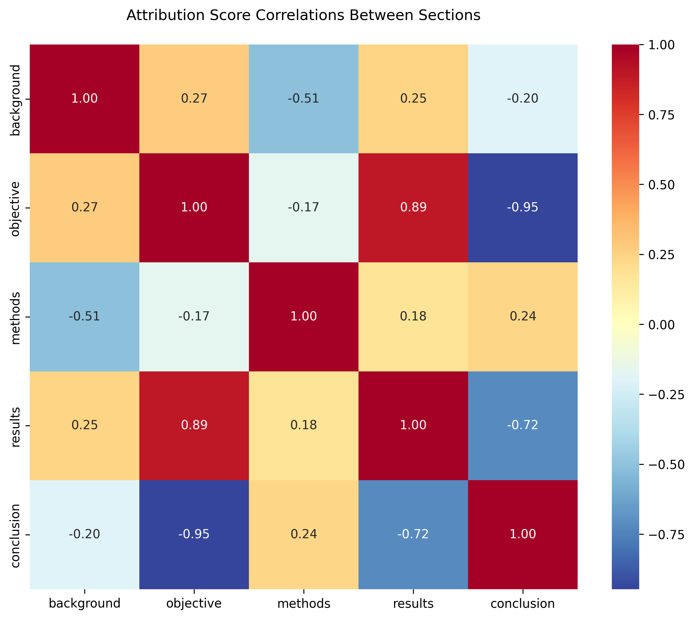
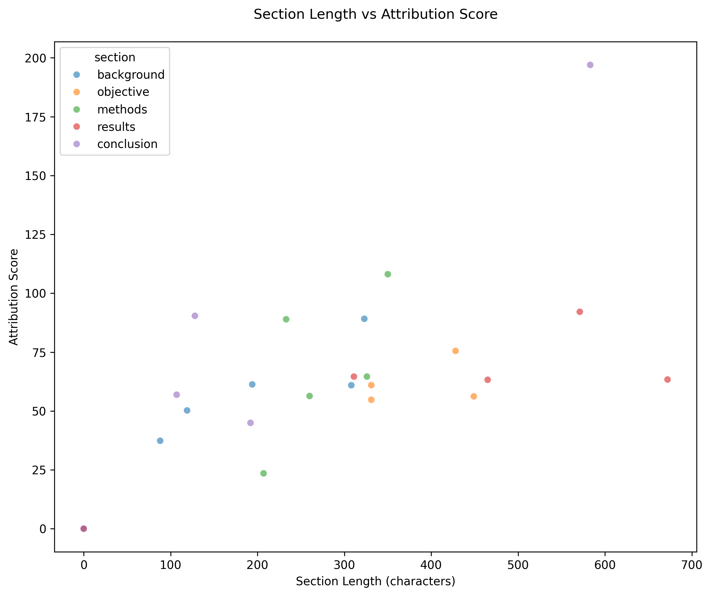

# LLM Scientific Hypothesis Generation Research

## Research Agenda

This research stream explores the intersection of Large Language Models (LLMs) and scientific discovery, focusing on understanding and potentially harnessing LLMs' capabilities for hypothesis generation.

### Thematic Question
How can we understand and potentially harness LLMs' hallucination mechanisms for "creative" hypothesis generation in the domain of scientific discovery?

### Specific Question
How do LLMs select between multiple hypotheses?

## Reports

### Report 1: Interpreting LLM-Generated Scientific Hypotheses (February 2025)

#### Technical Summary

This study investigates the mechanisms behind LLM-generated scientific hypotheses by analyzing how different sections of research paper abstracts influence the generation process. Using TinyLlama-1.1B-Chat and attribution analysis, we examined the relationship between abstract structure and hypothesis generation.

#### Methodology


The experiment uses Captum Feature Attribution framework to analyze how different sections of scientific abstracts influence the model's hypothesis generation process.

#### Key Findings

<table>
<tr align="center">
<td width="25%"><b>Section Influence</b></td>
<td width="25%"><b>Correlation Analysis</b></td>
<td width="25%"><b>Length Analysis</b></td>
<td width="25%"><b>Stability Analysis</b></td>
</tr>
<tr align="center">
<td></td>
<td></td>
<td></td>
<td></td>
</tr>
<tr>
<td>
- Conclusions: 23.7%<br>
- Methods: 21.3%<br>
- Background: 19.7%<br>
- Results: 18.5%<br>
- Objectives: 16.9%
</td>
<td>
- Strong negative correlation (-0.95) between objectives and conclusions<br>
- Strong positive correlation (0.89) between results and objectives<br>
- Moderate negative correlation (-0.51) between background and methods
</td>
<td>
No direct correlation between section length and attribution scores, suggesting content quality and positioning are more critical than length.
</td>
<td>
- Background sections show highest consistency (CV: 0.32)<br>
- Methods sections display moderate stability (CV: 0.47)<br>
- Conclusions show highest variability (CV: 0.95)
</td>
</tr>
</table>

#### Next Steps


Future work will focus on investigating the relationship between hypothesis generation, ranking, and attribution analysis.

## Repository Structure

```
.
├── reports/
│   └── report_070225.docx
│   └── llama_1b_v3_070225.ipynb
├── images/
│   ├── experimental_setup.png
│   ├── correlation_matrix.png
│   └── ...
├── data/
└── README.md
```
